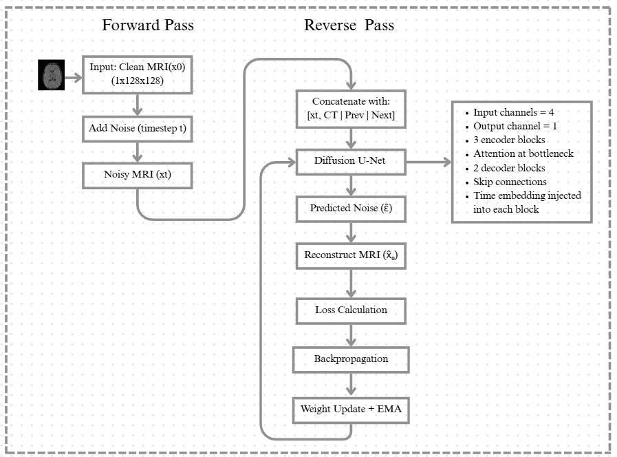

# Slice-Aware Diffusion Model for CT-to-MRI Translation

**Improving 3D Smoothness in Medical Image Translation Using Slice-Aware Diffusion**

**Author:** Devika P  
**Supervisor:** Dr. Kalyani Desikan  
**Institution:** Vellore Institute of Technology, India

---

## Overview

This repository contains the implementation of a **Slice-Aware Conditional Diffusion Model** for **CT-to-MRI medical image translation**. The framework is designed to generate MRI-like images from CT slices while improving **3D smoothness** and **inter-slice consistency** in reconstructed volumetric images.

Traditional 2D diffusion models process each slice independently, often producing discontinuities across adjacent slices. Our proposed approach incorporates neighboring slices during training and inference, enabling the model to preserve local volumetric context without the heavy computational cost of full 3D diffusion models.

---

## Project Description

The proposed framework translates paired CT slices into MRI-like images using a **slice-aware conditional diffusion model**. Instead of using a single CT slice as input, the model receives three consecutive slices:

- Previous slice: `S(t−1)`
- Current slice: `S(t)`
- Next slice: `S(t+1)`

This provides local 3D anatomical context and reduces abrupt transitions between reconstructed slices. The architecture is based on a conditional U-Net with timestep embeddings and an attention bottleneck.

---

## Key Features

- Slice-aware conditioning using neighboring CT slices
- Conditional diffusion model for CT-to-MRI translation
- U-Net with attention for long-range spatial dependency modeling
- Hybrid loss function combining noise prediction, SSIM, and inter-slice consistency losses
- Improved 3D smoothness without full 3D diffusion computation
- Memory-efficient training on 2D slices with local volumetric context

---

## Method Overview

### Slice-Aware Input

For each target MRI slice, the corresponding CT slice and its neighboring CT slices are stacked as a multi-channel input:

```text
Input = [CT(t−1), CT(t), CT(t+1)]
```

This formulation introduces limited volumetric context while keeping the computational cost close to a 2D model.

### Diffusion Process

- **Forward process:** Gaussian noise is gradually added to the ground-truth MRI slice.
- **Reverse process:** The network learns to predict and remove noise conditioned on the slice-aware CT input and diffusion timestep.

---


## Model Architecture

<p align="center">
  
</p>

The encoder extracts hierarchical features, the attention block models global dependencies, and the decoder reconstructs the denoised MRI slice.

---

## Dataset Structure

Organize the paired CT and MRI slices as:

```text
data_root/
├── train/
│   ├── CT/
│   └── MRI/
├── val/
│   ├── CT/
│   └── MRI/
└── test/
    ├── CT/
    └── MRI/
```

The CT and MRI slices are assumed to be spatially aligned paired data.

---

## Preprocessing

The preprocessing pipeline includes:

- Resize all images to **256 × 256**
- Normalize CT and MRI intensities to **[0, 1]** independently
- Preserve slice ordering for neighbor extraction
- Construct slice-aware triplets for each target slice

---

### Requirements

- Python 3.10+
- PyTorch
- torchvision
- numpy
- nibabel
- scikit-image
- matplotlib

---


The model progressively denoises from Gaussian noise to the final MRI prediction.

---

## Evaluation Metrics

The framework evaluates both image quality and volumetric consistency:

| Metric | Purpose |
|---|---|
| **PSNR** | Reconstruction fidelity |
| **SSIM** | Structural similarity |
| **Inter-Slice SSIM** | Slice-to-slice continuity |

Inter-Slice SSIM is used as a quantitative indicator of 3D smoothness.

---


## Qualitative Results

The generated MRI images show:

- Better preservation of anatomical structures
- Clearer tissue boundaries
- Reduced artifacts
- Smoother transitions between adjacent slices

The slice-aware model produces more anatomically coherent volumes than slice-by-slice diffusion.

---

## Acknowledgements

This work was carried out as part of the Master’s in Data Science program at **Vellore Institute of Technology** under the guidance of **Dr. Kalyani Desikan**.

The implementation is inspired by diffusion-based medical image translation frameworks and the official Guided Diffusion codebase.

---

## License

This project is released for **academic and research purposes only**. Please contact the author for permission regarding commercial use.
